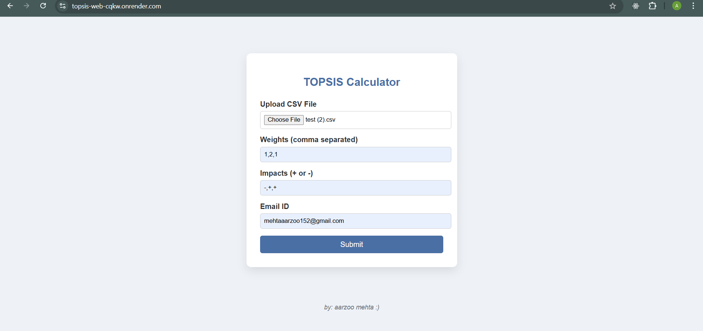
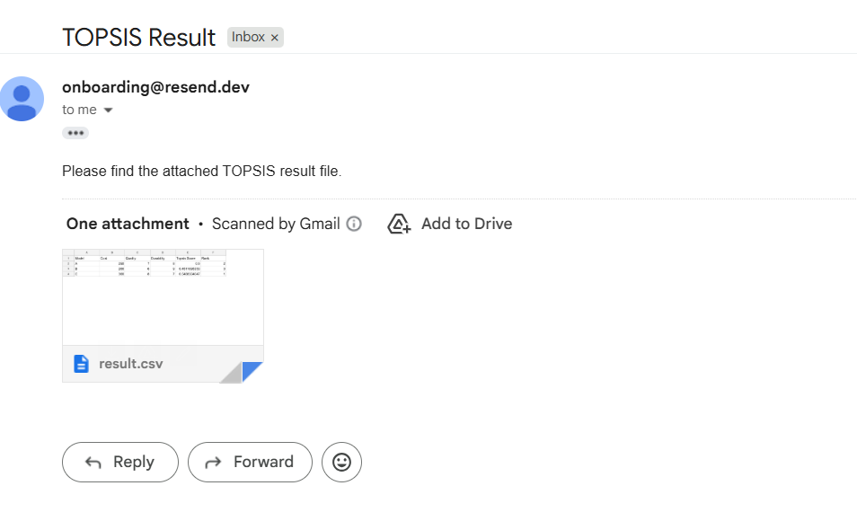

# Assignment1
## Part 1 - Implementation of Topsis in Python
This project implements the TOPSIS (Technique for Order Preference by Similarity to Ideal Solution) method using Python.
The program is designed to run as a command-line tool, following the specifications given in the assignment.

Libraries Used : pandas and numpy

### Usage
```bash
python topsis.py <InputDataFile> <Weights> <Impacts> <OutputResultFileName>
```
---
## Part 2 - Python Package 
This part of the project involves packaging the TOPSIS implementation as a Python package and uploading it to **PyPI** so it can be installed and used globally.

### Package Details

- **Package Name:** `topsis-aarzoo-102303061`
- **PyPI Link:** https://pypi.org/project/topsis-aarzoo-102303061/1.0.0/

## Installation

Install the package from PyPI using pip:

```bash
pip install topsis-aarzoo-102303061
```

---

## Part 3 - Topsis Web Service 
In this part, the TOPSIS algorithm is deployed as a **web-based service**, allowing users to perform TOPSIS analysis through a browser instead of the command line.

### Live Application
https://topsis-web-cqkw.onrender.com

## User Interface



### Sample Input
| Model | Cost | Quality | Durability |
|------|------|--------|-----------|
| A    | 250  | 7      | 8         |
| B    | 200  | 6      | 9         |
| C    | 300  | 8      | 7         |

## Output Result



### Sample Output
| Model | Cost | Quality | Durability | Topsis Score | Rank |
|------|------|--------|-----------|--------------|------|
| A    | 250  | 7      | 8         | 0.5000       | 2    |
| B    | 200  | 6      | 9         | 0.4511695353 | 3    |
| C    | 300  | 8      | 7         | 0.5488304647 | 1    |

### Technology Stack

- Backend: Python, Flask , Resend API(to send mails)
- Frontend: HTML, CSS
- Data Processing: Pandas, NumPy
- Deployment Platform: Render
